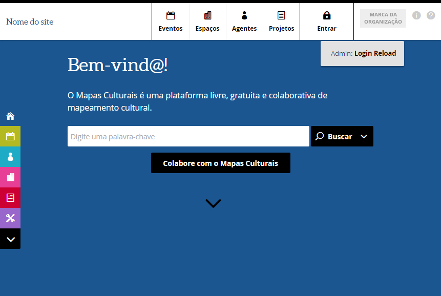

# Guia de Instalação e Configuração


## Ferramentas necessárias
 - VirtualBox
   - [Linux](https://www.virtualbox.org/wiki/Linux_Downloads)
    Para distribuições baseadas no [Debian](https://www.debian.org/) (*[Ubuntu](https://www.ubuntu.com/), [Mint](https://www.linuxmint.com/) e outros*), a execução do comando  ```sudo apt-get install virtualbox-5.1``` deve ser o suficiente para a instalação.

   - [Windows - VIRTUAL BOX VERSÃO 5.1.6](https://www.virtualbox.org/wiki/Download_Old_Builds_5_1)
     **Atenção!** Não utilize a versão [5.1.8 pois existe um bug](https://www.virtualbox.org/ticket/16084) que não permite ao *[Composer](https://getcomposer.org/)* baixar as dependências corretamente. Faça o download da [versão 5.1.6](http://download.virtualbox.org/virtualbox/5.1.6/VirtualBox-5.1.6-110634-Win.exe) ou alguma [versão de teste mais recente](https://www.virtualbox.org/wiki/Testbuilds)

 - [Vagrant](https://www.vagrantup.com/downloads.html)
   Novamente para linux baseados no Debian, o comando ```sudo apt-get install -y vagrant``` realizará a instalação da ferramenta.

 - [Git](https://git-scm.com/downloads)
  Novamente para linux baseados no Debian, o comando ```sudo apt-get install -y git``` realizará a instalação da ferramenta.

### Terminal no Sistema operacional  **Windows**

O [cmd](https://pt.wikipedia.org/wiki/Cmd.exe) do Windows não deve ser utilizado para execução dos comandos, por ser uma ferramenta limitada. Utilize para isso o **GitBash** (*instalado com o Git acima*) ou o [Cmder ](http://cmder.net/)

 O [Cmder ](http://cmder.net) é um emulador de console para Windows que disponibiliza toda a variedade de comandos do terminal Unix. Não requer instalação, basta descompactar o conteúdo e executar a aplicação.


## Instalação e configuração do **Mapas Culturais**

O projeto **Cultura Viva** é uma extensão (*tema*) do projeto **Mapas Culturais**, portanto, o primeiro passo é a instalação do projeto base.


### 1. Criação de diretório de trabalho

No diretório de desenvolvimento, criar uma pasta para o projeto.

```bash
cd caminho/para/diretório/desenvolvimento

mkdir "mapas"

cd mapas
```

### 2. Fazer um clone do projeto **Mapas Culturais**

Faremos o clone apenas da **branch estável v2**, não é necessário baixar todo o repositório do **Mapas Culturais**.

```bash
git clone -b v2 --single-branch https://github.com/hacklabr/mapasculturais.git

cd mapasculturais
```


### 3. Instalação, configuração e primeira execução do **Mapas Culturais**.

A configuração do **Vagrant** do **Mapas Culturais** não define a quantidade de memória necessária para a execução correta do processo de instalação.

Para prevenir problemas na instalação de dependências pelo ```composer.phar```, alterar o seguinte trecho do arquivo ```Vagrantfile``` , aumentando a quantidade de memória e opcionalmente o numero de processadores da máquina virtual.

Após a correta configuração do ambiente, pode-se voltar a configuração original.

```
config.vm.provider :virtualbox do |vb|
   vb.memory = 2048
   vb.cpus = 2
end
```

**Instalação no Windows**

Se estiver utilizando o sistema operacional **Windows**, alguns scripts não serão executados com sucesso, apresentando o erro ```: /bin/bash^M: bad interpreter: No such file or directory```.

Este [problema está associado ao formato do terminador de linha usado pelo windows](http://askubuntu.com/a/305001), para resolver estes problemas, execute no terminal.

```bash
# verifique se o dos2unix está disponível no PATH
# O aplicativo dos2unix foi instalado junto com o GIT
dos2unix.exe --version

# acesso ao diretório de scripts
cd scripts

# faz a conversão dos arquivos para o formato unix
# O aplicativo dos2unix fois instalado junto com o GIT
dos2unix.exe ./*.sh
dos2unix.exe ./report/*.sh


# volta ao diretório base
cd ..
```

**Finalizando a instalação**

Inicie o **Vagrant** para a instalação inicial do **Mapas Culturais** (*esse processa levará alguns minutos para concluir*).

```bash
vagrant up
```

Após isso, o **Mapas Culturais** estará disponível para acesso pelo navegador no endereço [http://127.0.0.1:8000](http://127.0.0.1:8000).



## Instalação e configuração do **Cultura Viva**

Agora vamos fazer a instalação do tema **Cultura Viva** dentro do **Mapas Culturais**.

### 1. Fazer o clone do projeto **Cultura Viva**

Ainda no diretório ```mapasculturais```:

```bash
#volte para o diretório "mapas"
cd ..

# baixe o repositório do projeto Cultura Viva
git clone https://github.com/culturagovbr/mapasculturais-culturaviva.git
```

Após baixar o **Cultura Viva**, devemos mover seu conteúdo para o diretório de temas do **Mapas Culturais**

```bash
mv mapasculturais-culturaviva mapasculturais/src/protected/application/themes
```

Neste momento, você já pode configurar o Projeto **Cultura Viva** na sua IDE favorita (e opcionalmente o projeto **Mapas Culturais**) .

- [Configurando um Projeto PHP no Netbeans](https://netbeans.org/kb/docs/php/project-setup_pt_BR.html#importSources)
- [Criando um projeto no PhpStorm](https://confluence.jetbrains.com/display/PhpStorm/Creating+a+Project+in+PhpStorm#CreatingaProjectinPhpStorm-CreateNewProjectfromExistingFiles)
- Outras IDE's, seguir a documentação


### 2. Configuração do  tema **mapasculturais-culturaviva**

Altere o arquivo ```mapasculturais/src/protected/application/conf/config.php``` conforme configuração abaixo.

```php
/* configure e descomente as linhas ....*/
'namespaces' => array(
    'MapasCulturais\Themes' => THEMES_PATH,
    'CulturaViva' => THEMES_PATH . 'mapasculturais-culturaviva'),
'themes.active' => 'CulturaViva',
```


No **ambiente de desenvolvimento**, pode se fazer também as alterações abaixo pra facilitar a depuração de erros.
```php
'doctrine.isDev' => true,
'slim.debug' => true,
```

### 3. Criação da base de dados do projeto  **Cultura Viva**

Ainda no diretório ```mapas```, no terminal:

```bash
# acessar o diretório mapasculturais
cd mapasculturais

# conectar a vm
vagrant ssh

# acessar o diretório de scripts
cd /vagrant/src/protected/application/themes/mapasculturais-culturaviva/scripts/

# criar o schema culturaviva
./db-install.sh
```


### 4. Recompilar os *assets* do tema e executar o  **Cultura Viva**

Ainda no diretório ```mapas```, no terminal:

```bash
# acessar o diretório mapasculturais
cd mapasculturais

# reiniciar a vm
vagrant reload
```

Acesse a máquina virtual para geração dos arquivos ```.css``` do tema.

```bash
# conectar a vm
vagrant ssh

# acessar o diretório de scripts (no terminal da vm)
cd /vagrant/scripts

# gerar css
./compile-sass.sh
```

Após a execução com sucesso, basta fechar a conexão ```ssh``` e visualizar o **Mapas Culturais** com o tema  **Cultura Viva**  disponível para acesso pelo navegador no endereço [http://127.0.0.1:8000](http://127.0.0.1:8000).

```bash
# sair da maquina virtual
exit
```


Pronto! o projeto **Cultura Viva**  foi configurado com sucesso.

## Depurando o **Mapas Culturais**

Depuração é uma etapa inevitável e importante de qualquer ciclo de desenvolvimento. No **Mapas Culturais** eventualmente você precisará fazer a depuração de alguma funcionalidade.

A configuração é simples, apenas 2 passos.

### 1. Instalação e configuração do x-debug

Para habilitar o [x-debug](https://xdebug.org/) no projeto, siga os passos abaixo.

Ainda no diretório ```mapasculturais```, no terminal:

```bash
# conectar a vm
vagrant ssh

# instalar a extensão x-debug do php
sudo apt-get install -y php5-xdebug

# Configurando o x-debug para debug remoto

# limpar o arquivo
sudo truncate -s 0 /etc/php5/fpm/conf.d/20-xdebug.ini

# registrar a extensão php
sudo sh -c 'echo "zend_extension=xdebug.so" >> /etc/php5/fpm/conf.d/20-xdebug.ini'

# habilitar o x-debug
sudo sh -c 'echo "xdebug.remote_enable=1" >> /etc/php5/fpm/conf.d/20-xdebug.ini'

# x-debug irá obter automaticamente a porta usada pela IDE
sudo sh -c 'echo "xdebug.remote_connect_back=1" >> /etc/php5/fpm/conf.d/20-xdebug.ini'

# sair da maquina virtual
exit

# reiniciar a vm
vagrant reload
```

### 2. Configurando a IDE e depurando o projeto

Após os passos acima, tendo configurando o projeto corretamente na sua IDE preferida, basta inserir os breakpoints e executar o projeto em modo de depuração.

- [Depurando o Código-Fonte do PHP no NetBeans IDE](https://netbeans.org/kb/docs/php/debugging_pt_BR.html)
- [Depurando PHP remoto no PhpStorm](https://confluence.jetbrains.com/display/PhpStorm/Debugging+PHP+Web+Applications+with+Run+Debug+Configurations#DebuggingPHPWebApplicationswithRunDebugConfigurations-PHPRemoteDebug)
- Outras IDE's, seguir a documentação


### Executando Profiler do projeto

O Profiler é uma poderosa ferramenta que lhe dá a capacidade de analisar O código PHP e determinar gargalos ou
geralmente ver quais partes do seu código são lentas e poderia usar um aumento de velocidade.

Abaixo, segue tutorial para uso do [WebGrind](https://github.com/jokkedk/webgrind) para a análise de execução do projeto.


Ainda no diretório ```mapasculturais```, no terminal:

```bash
# conectar a vm
vagrant ssh

# habilitando o profiler
sudo sh -c 'echo "xdebug.profiler_enable = 1" >> /etc/php5/fpm/conf.d/20-xdebug.ini'

# configurando para usar apenas com gatilho (veja como configurar sua IDE)
sudo sh -c 'echo "xdebug.profiler_enable_trigger = 1" >> /etc/php5/fpm/conf.d/20-xdebug.ini'

# sair da maquina virtual
exit

# reiniciar a vm
vagrant reload
```

Após isso, faça o download do [WebGrind](https://github.com/jokkedk/webgrind) e extraia no diretório ```mapasculturais/webgrind```.


Altera o arquivo ```Vagrantfile``` e adicione as configuraçães abaixo

```bash
# apos a linha:
php -S 0.0.0.0:8000 -t /vagrant/src /vagrant/src/router.php &

# adicione
php -S 0.0.0.0:8001 -t /vagrant/webgrind &


# apos a linha:
config.vm.network "forwarded_port", guest: 8000, host: 8000

# adicione
config.vm.network "forwarded_port", guest: 8001, host: 8001

# reiniciar a vm
vagrant reload
```

Então, no terminal:

```bash

# reiniciar a vm
vagrant reload

```

Pronto, basta acessar [http://localhost:8001](http://localhost:8001) no seu navegador e utilizar a ferramenta.